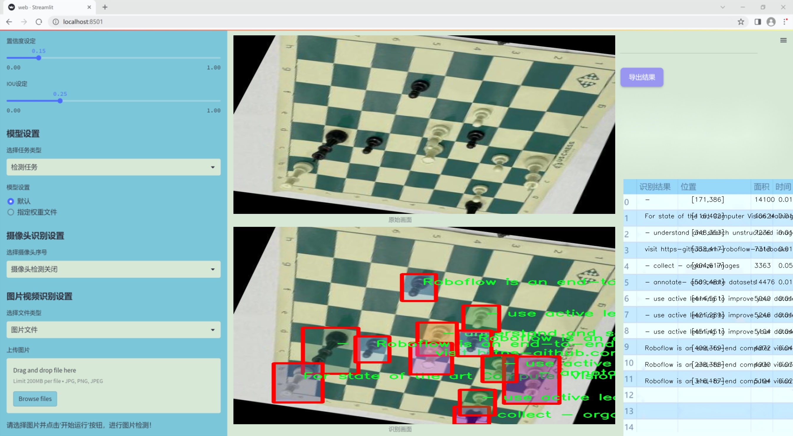
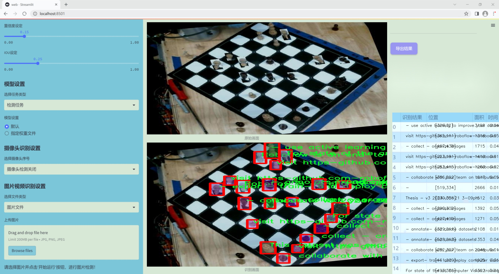
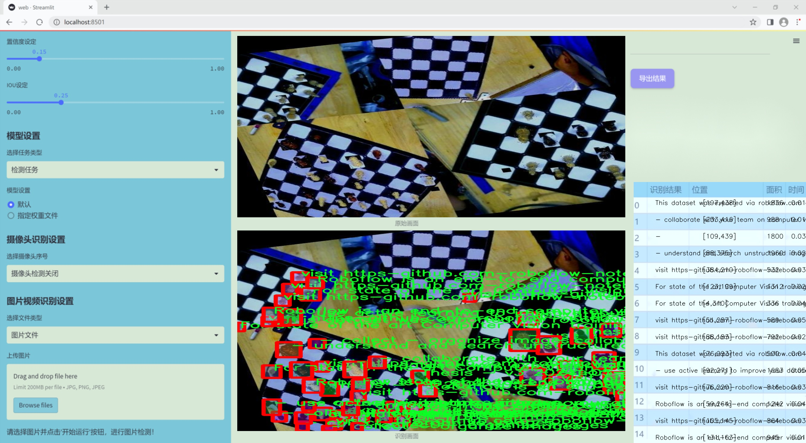
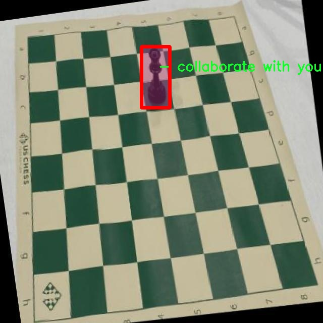
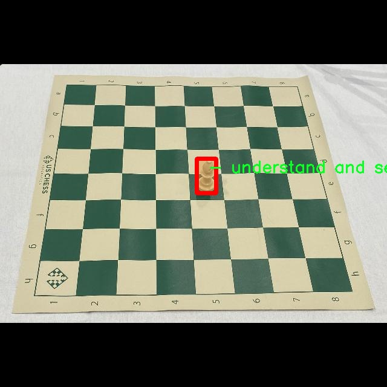
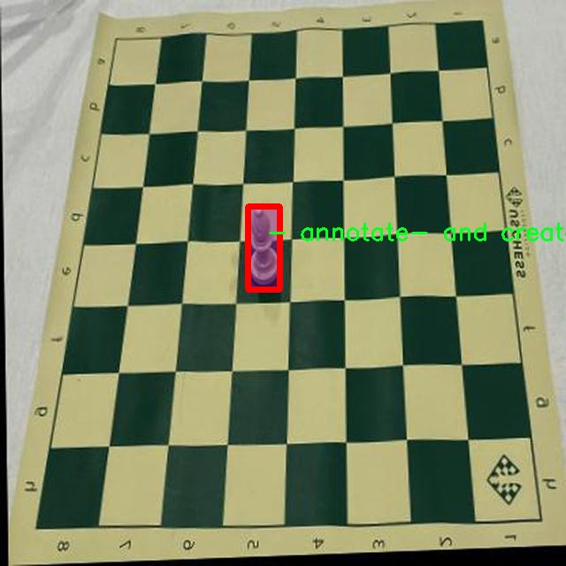
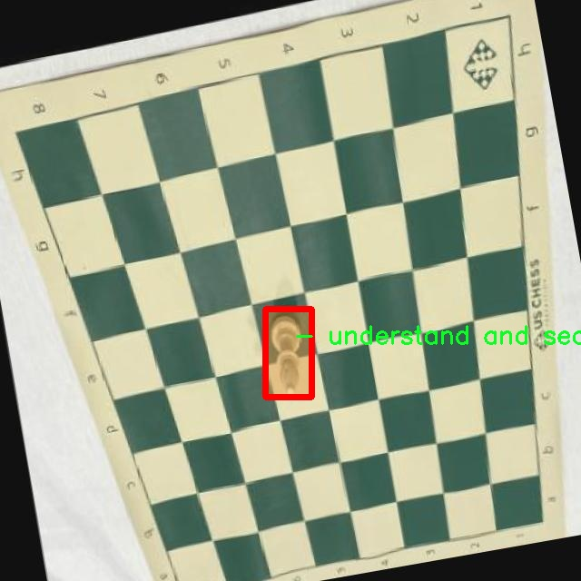
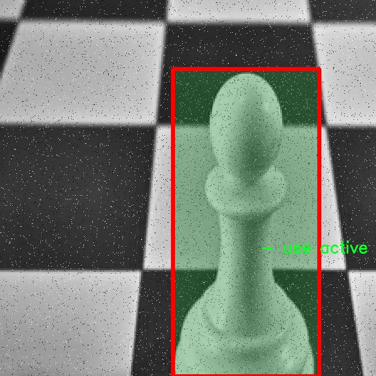

### 1.背景意义

研究背景与意义

随着人工智能技术的迅猛发展，计算机视觉在各个领域的应用日益广泛，尤其是在图像识别和实例分割方面。国际象棋作为一种经典的策略游戏，其棋子种类繁多且形态各异，给计算机视觉技术的应用提供了丰富的研究素材。基于此，构建一个高效的国际象棋棋子实例分割系统，不仅能够提升棋类游戏的智能化水平，还能为相关领域的研究提供新的思路和方法。

在国际象棋的实例分割任务中，传统的图像处理方法往往难以满足实时性和准确性的要求。因此，采用先进的深度学习模型，如YOLO（You Only Look Once）系列，成为了研究的热点。YOLOv11作为YOLO系列的最新版本，具有更高的检测精度和更快的处理速度，能够有效地识别和分割不同类型的棋子。通过对YOLOv11的改进，结合针对国际象棋棋子的特定需求，可以进一步提升模型的性能，使其在复杂背景下依然能够准确识别和分割棋子。

本研究所使用的数据集包含10000张经过精细标注的国际象棋棋子图像，涵盖了12种不同的棋子类别。这一数据集为模型的训练和评估提供了坚实的基础，能够有效支持模型在多样化场景下的泛化能力。通过对数据集的深度分析与处理，结合YOLOv11的强大功能，期望能够实现对国际象棋棋子的高效实例分割，为棋类游戏的智能化发展贡献力量。

此外，构建这一系统的意义还在于推动计算机视觉技术在其他领域的应用。通过对国际象棋棋子的实例分割研究，积累的经验和技术可以迁移到其他物体识别和分割任务中，促进计算机视觉技术的广泛应用与发展。因此，本研究不仅具有学术价值，也具备重要的实际应用前景。

### 2.视频效果

[2.1 视频效果](https://www.bilibili.com/video/BV1U2qGYSERt/)

### 3.图片效果







##### [项目涉及的源码数据来源链接](https://kdocs.cn/l/cszuIiCKVNis)**

注意：本项目提供训练的数据集和训练教程,由于版本持续更新,暂不提供权重文件（best.pt）,请按照6.训练教程进行训练后实现上图演示的效果。

### 4.数据集信息

##### 4.1 本项目数据集类别数＆类别名

nc: 12
names: ['-', '- annotate- and create datasets', '- collaborate with your team on computer vision projects', '- collect - organize images', '- export- train- and deploy computer vision models', '- understand and search unstructured image data', '- use active learning to improve your dataset over time', 'For state of the art Computer Vision training notebooks you can use with this dataset-', 'Roboflow is an end-to-end computer vision platform that helps you', 'Thesis - v3 2024-05-21 3-09pm', 'This dataset was exported via roboflow.com on June 14- 2024 at 3-09 AM GMT', 'visit https-github.com-roboflow-notebooks']


该项目为【图像分割】数据集，请在【训练教程和Web端加载模型教程（第三步）】这一步的时候按照【图像分割】部分的教程来训练

##### 4.2 本项目数据集信息介绍

本项目数据集信息介绍

本项目所使用的数据集专注于国际象棋棋子的实例分割，旨在改进YOLOv11模型的性能，以实现更高效的棋子识别和定位。该数据集包含12个类别，涵盖了国际象棋游戏中所有主要棋子的视觉特征。每个类别的样本经过精心标注，确保在训练过程中能够提供准确的输入数据，从而提升模型的识别能力和精度。具体而言，数据集中的类别包括：国王、皇后、车、马、象、兵等，确保涵盖了国际象棋的所有基本棋子。

数据集的构建过程注重数据的多样性和代表性，采集了不同光照、角度和背景下的棋子图像，以模拟真实游戏环境中的各种情况。这种多样性不仅增强了模型的泛化能力，还提高了其在复杂场景下的表现。此外，数据集还包含了经过专业标注的图像，确保每个棋子的边界和特征得到了准确的定义，从而为实例分割任务提供了坚实的基础。

为了支持模型的训练和优化，数据集还配备了丰富的附加信息，包括图像的来源、拍摄条件以及标注的详细说明。这些信息有助于研究人员在分析模型表现时进行更深入的理解和调整。同时，数据集的设计考虑到了未来的扩展性，支持通过主动学习等方法不断更新和完善，以适应日益变化的计算机视觉需求。

总之，本项目的数据集不仅为国际象棋棋子实例分割提供了高质量的训练材料，还为相关研究提供了宝贵的参考依据，助力于推动计算机视觉领域的进一步发展。











### 5.全套项目环境部署视频教程（零基础手把手教学）

[5.1 所需软件PyCharm和Anaconda安装教程（第一步）](https://www.bilibili.com/video/BV1BoC1YCEKi/?spm_id_from=333.999.0.0&vd_source=bc9aec86d164b67a7004b996143742dc)


[5.2 安装Python虚拟环境创建和依赖库安装视频教程（第二步）](https://www.bilibili.com/video/BV1ZoC1YCEBw?spm_id_from=333.788.videopod.sections&vd_source=bc9aec86d164b67a7004b996143742dc)

### 6.改进YOLOv11训练教程和Web_UI前端加载模型教程（零基础手把手教学）

[6.1 改进YOLOv11训练教程和Web_UI前端加载模型教程（第三步）](https://www.bilibili.com/video/BV1BoC1YCEhR?spm_id_from=333.788.videopod.sections&vd_source=bc9aec86d164b67a7004b996143742dc)


按照上面的训练视频教程链接加载项目提供的数据集，运行train.py即可开始训练



     Epoch   gpu_mem       box       obj       cls    labels  img_size
     1/200     20.8G   0.01576   0.01955  0.007536        22      1280: 100%|██████████| 849/849 [14:42<00:00,  1.04s/it]
               Class     Images     Labels          P          R     mAP@.5 mAP@.5:.95: 100%|██████████| 213/213 [01:14<00:00,  2.87it/s]
                 all       3395      17314      0.994      0.957      0.0957      0.0843

     Epoch   gpu_mem       box       obj       cls    labels  img_size
     2/200     20.8G   0.01578   0.01923  0.007006        22      1280: 100%|██████████| 849/849 [14:44<00:00,  1.04s/it]
               Class     Images     Labels          P          R     mAP@.5 mAP@.5:.95: 100%|██████████| 213/213 [01:12<00:00,  2.95it/s]
                 all       3395      17314      0.996      0.956      0.0957      0.0845

     Epoch   gpu_mem       box       obj       cls    labels  img_size
     3/200     20.8G   0.01561    0.0191  0.006895        27      1280: 100%|██████████| 849/849 [10:56<00:00,  1.29it/s]
               Class     Images     Labels          P          R     mAP@.5 mAP@.5:.95: 100%|███████   | 187/213 [00:52<00:00,  4.04it/s]
                 all       3395      17314      0.996      0.957      0.0957      0.0845


###### [项目数据集下载链接](https://kdocs.cn/l/cszuIiCKVNis)

### 7.原始YOLOv11算法讲解


YOLO11 是 Ultralytics YOLO 系列的最新版本，结合了尖端的准确性、速度和效率，用于目标检测、分割、分类、定向边界框和姿态估计。与
YOLOv8 相比，它具有更少的参数和更好的结果，不难预见，YOLO11 在边缘设备上更高效、更快，将频繁出现在计算机视觉领域的最先进技术（SOTA）中。


**主要特点**

  * **增强的特征提取：**YOLO11 使用改进的主干和颈部架构来增强特征提取，以实现更精确的目标检测和复杂任务的性能。

  * **针对效率和速度优化：**精细的架构设计和优化的训练流程在保持准确性和性能之间最佳平衡的同时，提供更快的处理速度。

  * **更少的参数，更高的准确度：**YOLO11m 在 COCO 数据集上实现了比 YOLOv8m 更高的 mAP，参数减少了 22%，提高了计算效率，同时不牺牲准确度。

  * **跨环境的适应性：**YOLO11 可以无缝部署在边缘设备、云平台和配备 NVIDIA GPU 的系统上，确保最大的灵活性。

  * **支持广泛的任务范围：**YOLO11 支持各种计算机视觉任务，如目标检测、实例分割、图像分类、姿态估计和定向目标检测（OBB）。


### 8.200+种全套改进YOLOV11创新点原理讲解

#### 8.1 200+种全套改进YOLOV11创新点原理讲解大全

由于篇幅限制，每个创新点的具体原理讲解就不全部展开，具体见下列网址中的改进模块对应项目的技术原理博客网址【Blog】（创新点均为模块化搭建，原理适配YOLOv5~YOLOv11等各种版本）

[改进模块技术原理博客【Blog】网址链接](https://gitee.com/qunmasj/good)


#### 8.2 精选部分改进YOLOV11创新点原理讲解

###### 这里节选部分改进创新点展开原理讲解(完整的改进原理见上图和[改进模块技术原理博客链接](https://gitee.com/qunmasj/good)【如果此小节的图加载失败可以通过CSDN或者Github搜索该博客的标题访问原始博客，原始博客图片显示正常】



### Diverse Branch Block简介
参考该博客提出的一种通用的卷积网络构造块用来在不增加任何推理时间的前提下提升卷积网络的性能。我们将这个块命名为分离分支块（Diverse Branch Block）。通过结合不同尺寸和复杂度的分离分支（包括串联卷积、多尺度卷积和平均池化层）来增加特征空间的方法，它提升了单个卷积的表达能力。完成训练后，一个DBB(Diverse Branch Block)可以被等价地转换为一个单独的卷积操作以方便部署。不同于那些新颖的卷积结构的改进方式，DBB让训练时微结构复杂化同时维持大规模结构，因此我们可以将它作为任意结构中通用卷积层的一种嵌入式替代形式。通过这种方式，我们能够将模型训练到一个更高的表现水平，然后在推理时转换成原始推理时间的结构。

 
主要贡献点：

（1） 我们建议合并大量的微结构到不同的卷积结构中来提升性能，但是维持原始的宏观结构。

（2）我们提出DBB，一个通用构造块结构，概括六种转换来将一个DBB结构转化成一个单独卷积，因为对于用户来说它是无损的。

（3）我们提出一个Inception-like DBB结构实例(Fig 1)，并且展示它在ImageNet、COCO detection 和CityScapes任务中获得性能提升。


#### 结构重参数化
本文和一个并发网络RepVGG[1]是第一个使用结构重参数化来命名该思路------使用从其他结构转化来的参数确定当前结构的参数。一个之前的工作ACNet[2]也可以被划分为结构重参数化，它提出使用非对称卷积块来增强卷积核的结构（i.e 十字形结构）。相比于DBB，它被设计来提升卷积网络（在没有额外推理时间损失的条件下）。这个流水线也包含将一个训练好的模型转化为另一个。但是，ACNet和DBB的区别是：ACNet的思想被激发是基于一个观察，这个观察是网络结构的参数在过去有更大的量级，因此寻找方法让参数量级更大，然而我们关注一个不同的点。我们发现 平均池化、1x1 conv 和 1x1-kxk串联卷积是更有效的，因为它们提供了不同复杂度的路线，以及允许使用更多训练时非线性化。除此以外，ACB结构可以看作是DBB结构的一种特殊形式，因为那个1xk和kx1卷积层能够被扩大成kxk（via Transform VI(Fig.2)），然后合并成一个平方核（via Transform II）。

 

#### 分离分支结构
卷积的线性性
一个卷积操作可以表示为 ，其中为输入tensor, 为输出tensor。卷积核表示为一个四阶tensor , 偏置为。将加偏置的操作表示为。

因为，在第j个输出通道（h,w）位置的值可以由以下公式给出：，其中表示输入帧I的第c个通道上的一个滑动窗，对应输出帧O的坐标（h,w）。从上式可以看出，卷积操作具有齐次性和加法性。


注意：加法性成立的条件是两个卷积具有相同的配置（即通道数、核尺寸、步长和padding等）。

#### 分离分支的卷积
在这一小节，我们概括六种转换形式（Fig.2）来转换一个具有batch normalization(BN)、branch addition、depth concatenation、multi-scale operations、avarage pooling 和 sequences of convolutions的DBB分支。


Transform I：a conv for conv-BN  我们通常会给一个卷积配备配备一个BN层，它执行逐通道正则化和线性尺度放缩。设j为通道索引，分别为累积的逐通道均值和标准差，分别为学习的尺度因子和偏置项，对应输出通道j为


卷积的齐次性允许我们融合BN操作到前述的conv来做推理。在实践中，我们仅仅建立一个拥有卷积核和偏置, 用从原始BN序列的参数转换来的值来赋值。我们为每个输出通道j构造


Transform II a conv for branch addition  卷积的加法性确保如果有两个或者多个具有相同配置的卷积层相加，我们能够将它们合并到一个单独的卷积里面。对于conv-BN，我们应该首先执行Transform I。很明显的，通过下面的公式我们能够合并两个卷积


上述公式只有在两个卷积拥有相同配置时才成立。尽管合并上述分支能够在一定程度上增强模型，我们希望结合不同分支来进一步提升模型性能。在后面，我们介绍一些分支的形式，它们能够等价地被转化为一个单独的卷积。在通过多个转化来为每一个分支构造KxK的卷积之后，我们使用Transform II 将所有分支合并到一个conv里面。

Transform III: a conv for sequential convolutions   我们能够合并一个1x1 conv-BN-kxk conv序列到一个kxk conv里面。我们暂时假设卷积是稠密的（即 组数 groups=1）。组数groups>1的情形将会在Transform IV中实现。我们假定1x1和kxk卷积层的核形状分别是DxCx1x1和ExDxKxK，这里D指任意值。首先，我们将两个BN层融合到两个卷积层里面，由此获得。输出是


我们期望用一个单独卷积的核和偏置来表达，设, 它们满足。对方程（8）应用卷积的加法性，我们有


因为是一个1x1 conv，它只执行逐通道线性组合，没有空间聚合操作。通过线性重组KxK卷积核中的参数，我们能够将它合并到一个KxK的卷积核里面。容易证明的是，这样的转换可以由一个转置卷积实现：


其中是由转置获得的tensor张量。方程（10）的第二项是作用于常量矩阵上的卷积操作，因此它的输出也是一个常量矩阵。用表达式来说明，设是一个常数矩阵，其中的每个元素都等于p。*是一个2D 卷积操作，W为一个2D 卷积核。转换结果就是一个常量矩阵，这个常量矩阵是p 与 所有核元素之和 的乘积，即


基于以上观察，我们构造。然后，容易证明。

因此我们有

显而易见地，对于一个zero-pads 的KxK卷积，方程（8）并不成立，因为并不对的结果做卷积操作(如果有一个零元素的额外的圈，方程（8）成立)。解决方案有A)用padding配置第一个卷积，第二个卷积不用，B)通过做pad操作。后者的一个有效实现是定制第一个BN层，为了（1）如通常的batch-normalize输入。（2）计算(通过方程（6）)。（3）用  pad batch-normalized结果，例如 用一圈 pad 每一个通道j 。

Transform IV: a conv for depth concatenation  Inception 单元使用深度concatenation来组合不同分支。当每个分支都只包含一个相同配置的卷积时，深度concatenation等价于一个卷积，它的核在不同的输出通道上concatenation（比如我们公式中的第一个轴）假设。我们concatenate它们到。显然地


Transform IV 可以非常方便地将Transform III 扩展到 groupwise（即 groups > 1） 的情景。直觉上，一个groupwise 卷积将输入分割成g个并行的组，单独卷积它们，然后concatenate形成输出。为了代替g-group卷积，我们建立一个DBB结构，这个结构的所有卷积层有相同的组g。为了转换一个1x1-KxK序列，我们等价地分割它们成为g组，单独执行Transform III, 然后concatenate获得输出（如图Fig3所示）。


Transform V: a conv for average pooling  一个作用于C通道的核尺寸为K，步长为s的平均池化层等价于一个拥有相同核尺寸K,步长s的卷积层。这样的核可以被构造为

  


就像一个通常的平均池化操作，当s>1时执行降采样操作，当s=1时保持相同尺寸。

Transform VI: a conv for multi-scale convolutions   考虑一个等价于一个拥有相同zero padding的 核。特别地，卷积是格外实用的，因为它们能够有效实现。应该对输入作pad操作来对齐滑动窗。


### 9.系统功能展示

图9.1.系统支持检测结果表格显示

  图9.2.系统支持置信度和IOU阈值手动调节

  图9.3.系统支持自定义加载权重文件best.pt(需要你通过步骤5中训练获得)

  图9.4.系统支持摄像头实时识别

  图9.5.系统支持图片识别

  图9.6.系统支持视频识别

  图9.7.系统支持识别结果文件自动保存

  图9.8.系统支持Excel导出检测结果数据


### 10. YOLOv11核心改进源码讲解

#### 10.1 SwinTransformer.py

以下是经过简化和注释的Swin Transformer代码，保留了核心部分并进行了详细的中文注释：

```python
import torch
import torch.nn as nn
import torch.nn.functional as F
import numpy as np
from timm.models.layers import DropPath, to_2tuple, trunc_normal_

class Mlp(nn.Module):
    """ 多层感知机（MLP）模块。"""
    
    def __init__(self, in_features, hidden_features=None, out_features=None, act_layer=nn.GELU, drop=0.):
        super().__init__()
        out_features = out_features or in_features  # 输出特征数
        hidden_features = hidden_features or in_features  # 隐藏层特征数
        self.fc1 = nn.Linear(in_features, hidden_features)  # 第一层线性变换
        self.act = act_layer()  # 激活函数
        self.fc2 = nn.Linear(hidden_features, out_features)  # 第二层线性变换
        self.drop = nn.Dropout(drop)  # Dropout层

    def forward(self, x):
        """ 前向传播函数。"""
        x = self.fc1(x)  # 线性变换
        x = self.act(x)  # 激活
        x = self.drop(x)  # Dropout
        x = self.fc2(x)  # 线性变换
        x = self.drop(x)  # Dropout
        return x

class WindowAttention(nn.Module):
    """ 窗口基础的多头自注意力模块。"""
    
    def __init__(self, dim, window_size, num_heads, qkv_bias=True, attn_drop=0., proj_drop=0.):
        super().__init__()
        self.dim = dim
        self.window_size = window_size  # 窗口大小
        self.num_heads = num_heads  # 注意力头数
        head_dim = dim // num_heads  # 每个头的维度
        self.scale = head_dim ** -0.5  # 缩放因子

        # 相对位置偏置表
        self.relative_position_bias_table = nn.Parameter(
            torch.zeros((2 * window_size[0] - 1) * (2 * window_size[1] - 1), num_heads))

        # 计算相对位置索引
        coords_h = torch.arange(self.window_size[0])
        coords_w = torch.arange(self.window_size[1])
        coords = torch.stack(torch.meshgrid([coords_h, coords_w]))  # 生成坐标网格
        coords_flatten = torch.flatten(coords, 1)  # 展平
        relative_coords = coords_flatten[:, :, None] - coords_flatten[:, None, :]  # 计算相对坐标
        relative_coords = relative_coords.permute(1, 2, 0).contiguous()  # 变换维度
        relative_coords[:, :, 0] += self.window_size[0] - 1  # 归一化
        relative_coords[:, :, 1] += self.window_size[1] - 1
        relative_coords[:, :, 0] *= 2 * self.window_size[1] - 1
        self.register_buffer("relative_position_index", relative_coords.sum(-1))  # 注册相对位置索引

        self.qkv = nn.Linear(dim, dim * 3, bias=qkv_bias)  # 线性变换生成Q、K、V
        self.attn_drop = nn.Dropout(attn_drop)  # 注意力Dropout
        self.proj = nn.Linear(dim, dim)  # 输出线性变换
        self.proj_drop = nn.Dropout(proj_drop)  # 输出Dropout
        trunc_normal_(self.relative_position_bias_table, std=.02)  # 初始化相对位置偏置
        self.softmax = nn.Softmax(dim=-1)  # Softmax层

    def forward(self, x, mask=None):
        """ 前向传播函数。"""
        B_, N, C = x.shape  # 获取输入的形状
        qkv = self.qkv(x).reshape(B_, N, 3, self.num_heads, C // self.num_heads).permute(2, 0, 3, 1, 4)  # 计算Q、K、V
        q, k, v = qkv[0], qkv[1], qkv[2]  # 分离Q、K、V

        q = q * self.scale  # 缩放Q
        attn = (q @ k.transpose(-2, -1))  # 计算注意力权重

        # 添加相对位置偏置
        relative_position_bias = self.relative_position_bias_table[self.relative_position_index.view(-1)].view(
            self.window_size[0] * self.window_size[1], self.window_size[0] * self.window_size[1], -1)
        relative_position_bias = relative_position_bias.permute(2, 0, 1).contiguous()  # 变换维度
        attn = attn + relative_position_bias.unsqueeze(0)  # 加入偏置

        attn = self.softmax(attn)  # Softmax归一化
        attn = self.attn_drop(attn)  # 注意力Dropout

        x = (attn @ v).transpose(1, 2).reshape(B_, N, C)  # 计算输出
        x = self.proj(x)  # 输出线性变换
        x = self.proj_drop(x)  # 输出Dropout
        return x

class SwinTransformer(nn.Module):
    """ Swin Transformer主类。"""
    
    def __init__(self, patch_size=4, in_chans=3, embed_dim=96, depths=[2, 2, 6, 2], num_heads=[3, 6, 12, 24]):
        super().__init__()
        self.patch_embed = PatchEmbed(patch_size=patch_size, in_chans=in_chans, embed_dim=embed_dim)  # 图像分块嵌入
        self.layers = nn.ModuleList()  # 存储每一层
        for i_layer in range(len(depths)):
            layer = BasicLayer(
                dim=int(embed_dim * 2 ** i_layer),
                depth=depths[i_layer],
                num_heads=num_heads[i_layer],
                window_size=7)  # 创建基本层
            self.layers.append(layer)

    def forward(self, x):
        """ 前向传播函数。"""
        x = self.patch_embed(x)  # 进行图像分块嵌入
        for layer in self.layers:
            x = layer(x)  # 逐层前向传播
        return x  # 返回最终输出

# 创建Swin Transformer模型
def SwinTransformer_Tiny(weights=''):
    model = SwinTransformer(depths=[2, 2, 6, 2], num_heads=[3, 6, 12, 24])  # 创建模型
    if weights:
        model.load_state_dict(torch.load(weights)['model'])  # 加载权重
    return model
```

### 代码说明：
1. **Mlp类**：实现了一个简单的多层感知机，包含两个线性层和一个激活函数。
2. **WindowAttention类**：实现了窗口基础的多头自注意力机制，支持相对位置偏置。
3. **SwinTransformer类**：是Swin Transformer的核心类，负责将输入图像分块并通过多个基本层进行处理。
4. **SwinTransformer_Tiny函数**：用于创建一个小型的Swin Transformer模型，并可选择加载预训练权重。

以上代码保留了Swin Transformer的核心结构，去除了不必要的细节和辅助函数，便于理解和使用。

该文件实现了Swin Transformer模型的结构，Swin Transformer是一种基于视觉的Transformer架构，采用了分层设计和窗口注意力机制，旨在处理图像任务。文件中包含多个类和函数，每个部分都有其特定的功能。

首先，文件导入了必要的库，包括PyTorch和一些用于构建模型的工具。接着定义了一个名为`Mlp`的类，它是一个多层感知机（MLP），用于在模型中进行前馈神经网络的计算。该类的构造函数接受输入特征、隐藏特征、输出特征、激活函数和丢弃率等参数，并在前向传播中依次通过线性层、激活函数和丢弃层。

接下来，定义了`window_partition`和`window_reverse`两个函数，分别用于将输入特征划分为窗口和将窗口特征合并回原始特征。这种窗口划分是Swin Transformer的核心思想之一，使得模型能够在局部窗口内进行自注意力计算。

`WindowAttention`类实现了窗口基础的多头自注意力机制（W-MSA），它支持相对位置偏置，并能够处理平移窗口（shifted window）。该类的构造函数定义了输入通道数、窗口大小、注意力头数等参数，并初始化了相对位置偏置表和其他必要的层。在前向传播中，该类计算查询、键、值，并应用相对位置偏置，最后输出经过注意力计算的特征。

`SwinTransformerBlock`类表示Swin Transformer的一个基本块，它包含了窗口注意力层和MLP层，并在前向传播中实现了残差连接和层归一化。该类还支持窗口的平移，以便在不同的块之间进行信息交互。

`PatchMerging`类用于将特征图的补丁合并，它通过线性层将四个相邻的补丁合并为一个新的补丁，并进行归一化处理。

`BasicLayer`类是Swin Transformer的一个基本层，包含多个Swin Transformer块，并在每个层的末尾可选择性地进行下采样。该类计算注意力掩码以支持平移窗口，并在前向传播中依次通过每个块。

`PatchEmbed`类将输入图像划分为补丁并进行嵌入，使用卷积层将补丁映射到指定的嵌入维度，并可选择性地进行归一化。

`SwinTransformer`类是整个模型的核心，负责构建和管理各个层。它支持多种参数配置，如补丁大小、层数、头数等，并在前向传播中依次通过各个层，最终输出所需的特征。

最后，文件中还定义了`update_weight`函数，用于更新模型的权重，并提供了一个`SwinTransformer_Tiny`函数，用于实例化一个小型的Swin Transformer模型，并可选择性地加载预训练权重。

总体而言，该文件实现了Swin Transformer的完整结构，涵盖了从输入图像到特征提取的各个步骤，适用于图像分类、目标检测等视觉任务。

#### 10.2 starnet.py

以下是简化后的核心代码，并附上详细的中文注释：

```python
import torch
import torch.nn as nn
from timm.models.layers import DropPath, trunc_normal_

class ConvBN(torch.nn.Sequential):
    """
    定义一个卷积层加批归一化层的组合。
    """
    def __init__(self, in_planes, out_planes, kernel_size=1, stride=1, padding=0, dilation=1, groups=1, with_bn=True):
        super().__init__()
        # 添加卷积层
        self.add_module('conv', torch.nn.Conv2d(in_planes, out_planes, kernel_size, stride, padding, dilation, groups))
        # 如果需要，添加批归一化层
        if with_bn:
            self.add_module('bn', torch.nn.BatchNorm2d(out_planes))
            # 初始化批归一化层的权重和偏置
            torch.nn.init.constant_(self.bn.weight, 1)
            torch.nn.init.constant_(self.bn.bias, 0)

class Block(nn.Module):
    """
    StarNet中的基本构建块，包含深度卷积和元素级乘法。
    """
    def __init__(self, dim, mlp_ratio=3, drop_path=0.):
        super().__init__()
        # 深度卷积层
        self.dwconv = ConvBN(dim, dim, 7, 1, (7 - 1) // 2, groups=dim, with_bn=True)
        # 线性变换层
        self.f1 = ConvBN(dim, mlp_ratio * dim, 1, with_bn=False)
        self.f2 = ConvBN(dim, mlp_ratio * dim, 1, with_bn=False)
        self.g = ConvBN(mlp_ratio * dim, dim, 1, with_bn=True)
        self.dwconv2 = ConvBN(dim, dim, 7, 1, (7 - 1) // 2, groups=dim, with_bn=False)
        self.act = nn.ReLU6()  # 激活函数
        self.drop_path = DropPath(drop_path) if drop_path > 0. else nn.Identity()  # 随机深度

    def forward(self, x):
        input = x  # 保存输入
        x = self.dwconv(x)  # 深度卷积
        x1, x2 = self.f1(x), self.f2(x)  # 线性变换
        x = self.act(x1) * x2  # 元素级乘法
        x = self.dwconv2(self.g(x))  # 经过第二个深度卷积
        x = input + self.drop_path(x)  # 残差连接
        return x

class StarNet(nn.Module):
    """
    StarNet模型的主类。
    """
    def __init__(self, base_dim=32, depths=[3, 3, 12, 5], mlp_ratio=4, drop_path_rate=0.0, num_classes=1000):
        super().__init__()
        self.num_classes = num_classes
        self.in_channel = 32
        # stem层，初始卷积层
        self.stem = nn.Sequential(ConvBN(3, self.in_channel, kernel_size=3, stride=2, padding=1), nn.ReLU6())
        dpr = [x.item() for x in torch.linspace(0, drop_path_rate, sum(depths))]  # 随机深度
        # 构建各个阶段
        self.stages = nn.ModuleList()
        cur = 0
        for i_layer in range(len(depths)):
            embed_dim = base_dim * 2 ** i_layer  # 当前层的嵌入维度
            down_sampler = ConvBN(self.in_channel, embed_dim, 3, 2, 1)  # 下采样层
            self.in_channel = embed_dim
            blocks = [Block(self.in_channel, mlp_ratio, dpr[cur + i]) for i in range(depths[i_layer])]  # 添加Block
            cur += depths[i_layer]
            self.stages.append(nn.Sequential(down_sampler, *blocks))  # 将下采样层和Block组合

    def forward(self, x):
        features = []
        x = self.stem(x)  # 通过stem层
        features.append(x)
        for stage in self.stages:
            x = stage(x)  # 通过每个阶段
            features.append(x)
        return features  # 返回特征

# 定义不同大小的StarNet模型
def starnet_s1(pretrained=False, **kwargs):
    model = StarNet(24, [2, 2, 8, 3], **kwargs)
    return model

def starnet_s2(pretrained=False, **kwargs):
    model = StarNet(32, [1, 2, 6, 2], **kwargs)
    return model

def starnet_s3(pretrained=False, **kwargs):
    model = StarNet(32, [2, 2, 8, 4], **kwargs)
    return model

def starnet_s4(pretrained=False, **kwargs):
    model = StarNet(32, [3, 3, 12, 5], **kwargs)
    return model
```

### 代码说明：
1. **ConvBN类**：封装了卷积层和批归一化层的组合，便于创建网络结构。
2. **Block类**：实现了StarNet的基本构建块，包含深度卷积、线性变换和元素级乘法，使用ReLU6激活函数。
3. **StarNet类**：主网络结构，包含多个阶段，每个阶段由下采样层和多个Block组成。通过`forward`方法提取特征。
4. **模型构建函数**：提供了不同配置的StarNet模型构建函数，便于用户根据需求创建不同大小的模型。

这个程序文件实现了一个名为StarNet的深度学习网络，主要用于图像处理任务。文件的开头包含了一些注释，说明了StarNet的设计理念，即尽量简化网络结构，以突出逐元素乘法的关键贡献。具体来说，网络设计中没有使用层级缩放（layer-scale），训练过程中也没有使用指数移动平均（EMA），这可能会进一步提高性能。

文件导入了必要的库，包括PyTorch和一些自定义的层。接下来，定义了一个模型URL字典，用于存储不同版本StarNet的预训练模型下载链接。

在代码中，首先定义了一个名为`ConvBN`的类，它是一个顺序容器，包含卷积层和可选的批归一化层。这个类的构造函数允许用户设置输入和输出通道数、卷积核大小、步幅、填充等参数，并初始化批归一化层的权重和偏置。

接着，定义了一个`Block`类，表示StarNet中的基本构建块。这个类包含多个卷积层和激活函数，并实现了前向传播的方法。在前向传播中，输入经过深度卷积、两个全连接层和逐元素乘法操作，最后通过另一个卷积层和残差连接输出。

然后，定义了`StarNet`类，这是整个网络的核心。构造函数中设置了网络的基本参数，包括基础维度、每个阶段的深度、MLP比率、随机丢弃率和类别数。网络由多个阶段组成，每个阶段包含一个下采样层和多个`Block`。在初始化时，网络的权重通过一个自定义的初始化方法进行初始化。

`StarNet`类的前向传播方法将输入数据通过网络的各个阶段，并收集特征图以供后续使用。

最后，文件定义了一些函数（如`starnet_s1`、`starnet_s2`等），用于创建不同配置的StarNet模型，并可选择加载预训练权重。这些函数根据不同的参数设置创建网络实例，并从指定的URL加载预训练模型的状态字典。

整体而言，这个程序文件实现了一个灵活且可扩展的深度学习网络，旨在提供高效的图像特征提取能力。

#### 10.3 CTrans.py

以下是经过简化和注释的核心代码部分，主要包括 `ChannelTransformer` 类及其相关组件。

```python
import torch
import torch.nn as nn
import numpy as np
from torch.nn import Dropout, LayerNorm

class Channel_Embeddings(nn.Module):
    """从图像块和位置嵌入构建通道嵌入。"""
    def __init__(self, patchsize, img_size, in_channels):
        super().__init__()
        img_size = (img_size, img_size)  # 将图像大小转换为元组
        patch_size = (patchsize, patchsize)  # 将补丁大小转换为元组
        n_patches = (img_size[0] // patch_size[0]) * (img_size[1] // patch_size[1])  # 计算补丁数量

        # 定义补丁嵌入层
        self.patch_embeddings = nn.Sequential(
            nn.MaxPool2d(kernel_size=5, stride=5),  # 最大池化层
            nn.Conv2d(in_channels=in_channels, out_channels=in_channels, kernel_size=patchsize // 5, stride=patchsize // 5)  # 卷积层
        )

        # 定义位置嵌入参数
        self.position_embeddings = nn.Parameter(torch.zeros(1, n_patches, in_channels))
        self.dropout = Dropout(0.1)  # Dropout层，防止过拟合

    def forward(self, x):
        """前向传播，计算嵌入。"""
        if x is None:
            return None
        x = self.patch_embeddings(x)  # 通过补丁嵌入层
        x = x.flatten(2)  # 展平
        x = x.transpose(-1, -2)  # 转置
        embeddings = x + self.position_embeddings  # 添加位置嵌入
        embeddings = self.dropout(embeddings)  # 应用Dropout
        return embeddings

class ChannelTransformer(nn.Module):
    """通道变换器模型。"""
    def __init__(self, channel_num=[64, 128, 256, 512], img_size=640, patchSize=[40, 20, 10, 5]):
        super().__init__()

        # 初始化补丁大小和嵌入层
        self.embeddings_1 = Channel_Embeddings(patchSize[0], img_size=img_size // 8, in_channels=channel_num[0])
        self.embeddings_2 = Channel_Embeddings(patchSize[1], img_size=img_size // 16, in_channels=channel_num[1])
        self.embeddings_3 = Channel_Embeddings(patchSize[2], img_size=img_size // 32, in_channels=channel_num[2])
        self.embeddings_4 = Channel_Embeddings(patchSize[3], img_size=img_size // 64, in_channels=channel_num[3]) if len(channel_num) == 4 else nn.Identity()

    def forward(self, en):
        """前向传播，计算输出。"""
        # 根据输入的数量选择相应的嵌入
        if len(en) == 3:
            en1, en2, en3 = en
            en4 = None
        elif len(en) == 4:
            en1, en2, en3, en4 = en
        
        # 计算嵌入
        emb1 = self.embeddings_1(en1) if en1 is not None else None
        emb2 = self.embeddings_2(en2) if en2 is not None else None
        emb3 = self.embeddings_3(en3) if en3 is not None else None
        emb4 = self.embeddings_4(en4) if en4 is not None else None

        # 返回经过嵌入后的结果
        return [emb1, emb2, emb3, emb4]

class GetIndexOutput(nn.Module):
    """获取特定索引的输出。"""
    def __init__(self, index) -> None:
        super().__init__()
        self.index = index
    
    def forward(self, x):
        """返回指定索引的输出。"""
        return x[self.index]
```

### 代码说明：
1. **Channel_Embeddings 类**：负责将输入图像转换为补丁嵌入和位置嵌入，并应用 Dropout 以减少过拟合。
2. **ChannelTransformer 类**：构建整个通道变换器模型，包含多个嵌入层。根据输入的数量，选择相应的嵌入。
3. **GetIndexOutput 类**：用于从输出中获取特定索引的结果，方便后续处理。

以上是核心部分的代码和详细注释，帮助理解模型的结构和功能。

这个程序文件 `CTrans.py` 实现了一个名为 `ChannelTransformer` 的深度学习模型，主要用于图像处理任务。模型的结构和功能可以分为几个主要部分。

首先，文件导入了一些必要的库，包括 PyTorch 和 NumPy，这些库提供了构建和训练神经网络所需的基础功能。接着，定义了一些类，每个类负责模型的不同组成部分。

`Channel_Embeddings` 类用于构建输入图像的嵌入。它通过卷积和池化操作将输入图像划分为多个小块（patch），并为每个小块生成位置嵌入。该类的 `forward` 方法负责将输入数据转换为嵌入表示，并应用 dropout 操作以防止过拟合。

`Reconstruct` 类则用于重建特征图，它通过卷积和上采样操作将嵌入特征图转换回原始图像的尺寸。这个类的 `forward` 方法将输入的嵌入转换为更高分辨率的特征图，并应用批归一化和激活函数。

`Attention_org` 类实现了多头自注意力机制。它通过查询（query）、键（key）和值（value）向量的线性变换计算注意力分数，并通过 softmax 函数生成注意力权重。这个类的 `forward` 方法接收多个嵌入，并计算它们之间的注意力关系，最终输出加权后的特征表示。

`Mlp` 类实现了一个简单的多层感知机（MLP），包含两个全连接层和激活函数。它用于在特征表示上进行非线性变换。

`Block_ViT` 类将自注意力机制和 MLP 结合在一起，形成一个完整的 Transformer 块。它在 `forward` 方法中依次应用注意力机制和 MLP，对输入的嵌入进行处理，并添加残差连接以保持信息流动。

`Encoder` 类则由多个 `Block_ViT` 组成，负责对输入的嵌入进行多层处理，提取更高层次的特征。

`ChannelTransformer` 类是整个模型的核心，包含了嵌入层、编码器和重建层。它的 `forward` 方法接收输入图像的多个通道，生成嵌入，经过编码器处理后，再通过重建层输出结果。

最后，`GetIndexOutput` 类用于从模型的输出中提取特定索引的结果，便于后续处理。

整体来看，这个程序实现了一个基于 Transformer 的图像处理模型，结合了自注意力机制和多层感知机，能够有效地处理图像数据并提取特征。模型的设计考虑了多通道输入，适用于复杂的图像分析任务。

#### 10.4 EfficientFormerV2.py

以下是经过简化并添加详细中文注释的核心代码部分：

```python
import torch
import torch.nn as nn
import math
import itertools

class Attention4D(nn.Module):
    """
    4D注意力机制模块
    """
    def __init__(self, dim=384, key_dim=32, num_heads=8, attn_ratio=4, resolution=7, act_layer=nn.ReLU, stride=None):
        super().__init__()
        self.num_heads = num_heads  # 注意力头的数量
        self.scale = key_dim ** -0.5  # 缩放因子
        self.key_dim = key_dim  # 键的维度
        self.nh_kd = key_dim * num_heads  # 每个头的键的总维度

        # 根据stride调整分辨率
        if stride is not None:
            self.resolution = math.ceil(resolution / stride)
            self.stride_conv = nn.Sequential(
                nn.Conv2d(dim, dim, kernel_size=3, stride=stride, padding=1, groups=dim),
                nn.BatchNorm2d(dim),
            )
            self.upsample = nn.Upsample(scale_factor=stride, mode='bilinear')
        else:
            self.resolution = resolution
            self.stride_conv = None
            self.upsample = None

        self.N = self.resolution ** 2  # 总的空间位置数
        self.d = int(attn_ratio * key_dim)  # 输出的维度
        self.dh = self.d * num_heads  # 每个头的输出维度总和

        # 定义查询、键、值的卷积层
        self.q = nn.Sequential(nn.Conv2d(dim, self.num_heads * self.key_dim, 1), nn.BatchNorm2d(self.num_heads * self.key_dim))
        self.k = nn.Sequential(nn.Conv2d(dim, self.num_heads * self.key_dim, 1), nn.BatchNorm2d(self.num_heads * self.key_dim))
        self.v = nn.Sequential(nn.Conv2d(dim, self.num_heads * self.d, 1), nn.BatchNorm2d(self.num_heads * self.d))

        # 定义局部值的卷积层
        self.v_local = nn.Sequential(
            nn.Conv2d(self.num_heads * self.d, self.num_heads * self.d, kernel_size=3, stride=1, padding=1, groups=self.num_heads * self.d),
            nn.BatchNorm2d(self.num_heads * self.d),
        )

        # 定义投影层
        self.proj = nn.Sequential(act_layer(), nn.Conv2d(self.dh, dim, 1), nn.BatchNorm2d(dim))

        # 计算注意力偏置
        points = list(itertools.product(range(self.resolution), range(self.resolution)))
        attention_offsets = {}
        idxs = []
        for p1 in points:
            for p2 in points:
                offset = (abs(p1[0] - p2[0]), abs(p1[1] - p2[1]))
                if offset not in attention_offsets:
                    attention_offsets[offset] = len(attention_offsets)
                idxs.append(attention_offsets[offset])
        self.attention_biases = nn.Parameter(torch.zeros(num_heads, len(attention_offsets)))
        self.register_buffer('attention_bias_idxs', torch.LongTensor(idxs).view(self.N, self.N))

    def forward(self, x):  # x的形状为(B, C, H, W)
        B, C, H, W = x.shape
        if self.stride_conv is not None:
            x = self.stride_conv(x)  # 应用步幅卷积

        # 计算查询、键、值
        q = self.q(x).flatten(2).reshape(B, self.num_heads, -1, self.N).permute(0, 1, 3, 2)
        k = self.k(x).flatten(2).reshape(B, self.num_heads, -1, self.N).permute(0, 1, 2, 3)
        v = self.v(x)
        v_local = self.v_local(v)
        v = v.flatten(2).reshape(B, self.num_heads, -1, self.N).permute(0, 1, 3, 2)

        # 计算注意力权重
        attn = (q @ k) * self.scale + self.attention_biases[:, self.attention_bias_idxs]
        attn = attn.softmax(dim=-1)  # 归一化

        # 计算输出
        x = (attn @ v)
        out = x.transpose(2, 3).reshape(B, self.dh, self.resolution, self.resolution) + v_local
        if self.upsample is not None:
            out = self.upsample(out)

        out = self.proj(out)  # 投影到原始维度
        return out


class EfficientFormerV2(nn.Module):
    """
    EfficientFormerV2模型
    """
    def __init__(self, layers, embed_dims=None, mlp_ratios=4, downsamples=None, num_classes=1000):
        super().__init__()
        self.patch_embed = nn.Conv2d(3, embed_dims[0], kernel_size=3, stride=2, padding=1)  # 初始的卷积嵌入层

        network = []
        for i in range(len(layers)):
            # 添加每个阶段的块
            stage = eformer_block(embed_dims[i], i, layers)
            network.append(stage)
            if downsamples[i] or embed_dims[i] != embed_dims[i + 1]:
                # 添加下采样层
                network.append(Embedding(in_chans=embed_dims[i], embed_dim=embed_dims[i + 1]))

        self.network = nn.ModuleList(network)  # 将网络层存储为ModuleList

    def forward(self, x):
        x = self.patch_embed(x)  # 通过嵌入层
        for block in self.network:
            x = block(x)  # 逐层前向传播
        return x


def eformer_block(dim, index, layers):
    """
    创建一个EfficientFormer的块
    """
    blocks = []
    for block_idx in range(layers[index]):
        blocks.append(Attention4D(dim))  # 添加注意力层
    return nn.Sequential(*blocks)  # 返回一个顺序模块


# 创建模型实例的函数
def efficientformerv2_s0(weights='', **kwargs):
    model = EfficientFormerV2(
        layers=[2, 2, 6, 4],  # 每个阶段的层数
        embed_dims=[32, 48, 96, 176],  # 嵌入维度
        downsamples=[True, True, True, True],  # 是否下采样
        **kwargs
    )
    if weights:
        pretrained_weight = torch.load(weights)['model']
        model.load_state_dict(pretrained_weight)  # 加载预训练权重
    return model
```

### 代码说明
1. **Attention4D类**：实现了一个4D注意力机制模块，包含查询、键、值的计算和注意力权重的生成。
2. **EfficientFormerV2类**：构建了EfficientFormerV2模型的主要结构，包含多个阶段的块和嵌入层。
3. **eformer_block函数**：用于创建一个EfficientFormer的块，包含多个注意力层。
4. **efficientformerv2_s0函数**：用于实例化EfficientFormerV2模型，并加载预训练权重（如果提供）。

这些核心部分是构建EfficientFormerV2模型的基础，包含了模型的主要功能和结构。

这个程序文件定义了一个名为 `EfficientFormerV2` 的深度学习模型，主要用于图像处理任务，如图像分类。代码中包含了多个类和函数，构成了整个模型的结构和功能。

首先，文件中导入了一些必要的库，包括 PyTorch 及其相关模块，数学库，以及一些用于模型构建的工具函数。接着，定义了一些超参数字典，例如 `EfficientFormer_width` 和 `EfficientFormer_depth`，这些字典分别定义了不同模型版本的宽度和深度。这些参数将用于创建不同规模的 EfficientFormer 模型。

接下来，定义了多个类，其中 `Attention4D` 类实现了一个四维注意力机制，允许模型在空间上进行更复杂的特征提取。该类中包含了多种卷积层和注意力计算的逻辑，能够处理输入的特征图并生成注意力加权的输出。

`LGQuery` 类用于生成局部和全局查询特征，通过平均池化和卷积操作来实现特征的降维和整合。`Attention4DDownsample` 类则是对输入特征进行下采样的注意力模块，结合了局部特征和全局特征。

`Embedding` 类负责将输入图像转换为嵌入特征，支持不同的处理方式（如轻量级处理或带注意力机制的处理）。`Mlp` 类实现了一个多层感知机，使用 1x1 卷积来进行特征的变换和激活。

`AttnFFN` 和 `FFN` 类分别实现了带注意力机制的前馈网络和普通前馈网络，二者都支持层归一化和丢弃率的设置。`eformer_block` 函数用于构建 EfficientFormer 的基本块，结合了注意力和前馈网络。

`EfficientFormerV2` 类是整个模型的核心，负责构建网络的不同层次和模块。它的构造函数接受多个参数，包括层数、嵌入维度、下采样策略等，并根据这些参数构建网络结构。该类还定义了 `forward` 方法，用于前向传播，返回特征输出。

此外，文件中还定义了几个函数（如 `update_weight`、`efficientformerv2_s0` 等），用于加载预训练权重和创建不同版本的 EfficientFormer 模型。

最后，在 `__main__` 块中，代码示例展示了如何创建不同规模的 EfficientFormer 模型，并使用随机输入进行前向传播，输出各层的特征图大小。这部分代码用于测试模型的构建和运行是否正常。

整体来看，这个程序文件实现了一个高效的图像处理模型，利用注意力机制和多层感知机结构，旨在提高特征提取的效率和效果。

### 11.完整训练+Web前端界面+200+种全套创新点源码、数据集获取


# [下载链接：https://mbd.pub/o/bread/Z5yYmp5t](https://mbd.pub/o/bread/Z5yYmp5t)